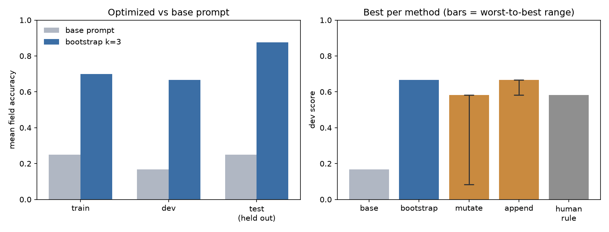

# prompt-lab

An eval harness and prompt optimizer for local LLMs. Runs entirely on
Ollama — no hosted APIs, no keys, no cost.

Given a task (dataset + starting prompt + scorer), it automatically
searches for a better prompt and records every candidate and score in
SQLite so results are reproducible and comparable.



*Right panel: whiskers show the worst-to-best range across variants of the same method. The human-written rule was applied on top of bootstrap's 0.667 prompt — it lowered the score.*

## Results

Task: extract `{company, title, location, remote}` as JSON from messy
job postings. Model: `llama3.1:8b`. Scored on per-field exact match.

| | base prompt | bootstrap (k=3) |
|---|---|---|
| train | 0.250 | 0.700 |
| dev | 0.167 | 0.667 |
| **test (held out)** | **0.250** | **0.875** |

The test split was scored once, at the end, and never optimized against.

## What I found

**The baseline failed on format, not comprehension.** The one-line base
prompt returned `jobTitle`, `workType`, `onsiteDays` — correct values
under invented key names. Everything after that was schema compliance.

**Three optimizers, one winner.** Few-shot demos (bootstrap) beat both
LLM-driven methods:

- `bootstrap` — glue worked examples onto the prompt. Deterministic, 0.667.
- `mutate` — show the model its failures, ask for a rewrite. Best 0.583,
  worst 0.083 (below base). It overfit to the exact failures it was shown,
  writing literal rules like `"Block from" indicates location is nearby`
  and inventing a `duration` field that isn't in the schema.
- `append` — show failures, ask for one general rule. Low variance, but
  all four generated rules were about key naming — even though the
  failures it was given had location wrong in 4 of 4 cases.

**A prompt can't be evaluated by reading it.** The worst mutate variant
reads perfectly well to a human and scores half as well as the lazy
one-line base. It dropped the word "JSON" and added a fifth field.

**The ceiling was the model, not the search.** After bootstrap, every
remaining error was location normalization (`"Chicago"` vs `"Chicago, IL"`).
Nothing moved it: not three optimizers, not a hand-written rule stating
the format explicitly, not a demo showing the transform. The hand-written
rule actually *lowered* the score — locations were unchanged and an
unrelated field regressed.

## Caveats

10 hand-written cases (5 train / 3 dev / 2 test). Dev scores quantize to
1/12 and test to 1/8, so the k-sweep ablation is underpowered and the
test-beats-dev gap is noise. Two cases encode judgment calls rather than
ground truth: `"Union Square"` → `"San Francisco, CA"` is ambiguous, and
`"confidential"` → `null` company is defensible either way.

## Running it

```bash
python -m venv venv && source venv/bin/activate
pip install requests matplotlib
ollama pull llama3.1:8b

python -m lab.runner tasks/extract train        # score a prompt
python -m lab.select tasks/extract dev bootstrap # optimize
```

Every model call is cached in SQLite keyed on model + prompt + temperature,
so re-runs are instant and scores are deterministic.

## Structure
cat > README.md << 'EOF'
# prompt-lab

An eval harness and prompt optimizer for local LLMs. Runs entirely on
Ollama — no hosted APIs, no keys, no cost.

Given a task (dataset + starting prompt + scorer), it automatically
searches for a better prompt and records every candidate and score in
SQLite so results are reproducible and comparable.


*Right panel: whiskers show the worst-to-best range across variants of the same method. The human-written rule was applied on top of bootstrap's 0.667 prompt — it lowered the score.*

## Results

Task: extract `{company, title, location, remote}` as JSON from messy
job postings. Model: `llama3.1:8b`. Scored on per-field exact match.

| | base prompt | bootstrap (k=3) |
|---|---|---|
| train | 0.250 | 0.700 |
| dev | 0.167 | 0.667 |
| **test (held out)** | **0.250** | **0.875** |

The test split was scored once, at the end, and never optimized against.

## What I found

**The baseline failed on format, not comprehension.** The one-line base
prompt returned `jobTitle`, `workType`, `onsiteDays` — correct values
under invented key names. Everything after that was schema compliance.

**Three optimizers, one winner.** Few-shot demos (bootstrap) beat both
LLM-driven methods:

- `bootstrap` — glue worked examples onto the prompt. Deterministic, 0.667.
- `mutate` — show the model its failures, ask for a rewrite. Best 0.583,
  worst 0.083 (below base). It overfit to the exact failures it was shown,
  writing literal rules like `"Block from" indicates location is nearby`
  and inventing a `duration` field that isn't in the schema.
- `append` — show failures, ask for one general rule. Low variance, but
  all four generated rules were about key naming — even though the
  failures it was given had location wrong in 4 of 4 cases.

**A prompt can't be evaluated by reading it.** The worst mutate variant
reads perfectly well to a human and scores half as well as the lazy
one-line base. It dropped the word "JSON" and added a fifth field.

**The ceiling was the model, not the search.** After bootstrap, every
remaining error was location normalization (`"Chicago"` vs `"Chicago, IL"`).
Nothing moved it: not three optimizers, not a hand-written rule stating
the format explicitly, not a demo showing the transform. The hand-written
rule actually *lowered* the score — locations were unchanged and an
unrelated field regressed.

## Caveats

10 hand-written cases (5 train / 3 dev / 2 test). Dev scores quantize to
1/12 and test to 1/8, so the k-sweep ablation is underpowered and the
test-beats-dev gap is noise. Two cases encode judgment calls rather than
ground truth: `"Union Square"` → `"San Francisco, CA"` is ambiguous, and
`"confidential"` → `null` company is defensible either way.

## Running it

```bash
python -m venv venv && source venv/bin/activate
pip install requests matplotlib
ollama pull llama3.1:8b

python -m lab.runner tasks/extract train        # score a prompt
python -m lab.select tasks/extract dev bootstrap # optimize
```

Every model call is cached in SQLite keyed on model + prompt + temperature,
so re-runs are instant and scores are deterministic.

## Structure
